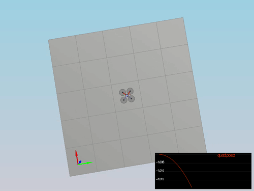

# FCND-Control-CPP  
Project-3 : Control of a 3D Quadrotor

This is the readme addressing all the points of the project rubric.

In this project we implement a controller for a quadcopter that has two feed forward P controllers - Body Rate Controller, Yaw Contoller and Roll pitch controller, one PD controller - Lateral Position controller while the Altitude controller is a PID controller.

The contollers were implemented and tuned in five steps each involving a scenario in simulation. When we pass the required criteria for a scenario a PASS remark is displayed on the terminal. The passing of a scenario is shown below in respective gif and video in mp4 files located in [/gif](./gif) and [/videos](./videos) dir respectively.

## Code Files
All the required c++ files is located in the [/cpp](./cpp)
- [QuadControl.cpp](./cpp/QuadControl.cpp): This file is where all the controllers are implemented in c++.
- [QuadContolParams.txt](./cpp/QuadControlParams.txt): This file is where all the contoller gains P, I, D are written and this is where we tune them by changing their values in the file.

### Scenarios
#### Intro (scenario 1)
Here we adjust the mass of the drone in [QuadContolParams.txt](./cpp/QuadControlParams.txt) such that it just hovers as shown below:

Video File: [scenario1.mp4](./videos/scenario1.mp4)
Terminal Output: 

#### Attitude control (scenario 2)
Here, I implemented and tuned the body rate and roll / pitch control.  

1. Body rate control

 - implemented the code in the function [GenerateMotorCommands()](./cpp/QuadControl.cpp#L72-L104)
 - implemented the code in the function [BodyRateControl()](./cpp/QuadControl.cpp#L127-L139)
 - Tuned `kpPQR` in [QuadControlParams.txt](./cpp/QuadControlParams.txt#L35) to get the vehicle to stop spinning quickly but not overshoot

2. Roll / pitch control
  
 - implemented the code in the function [RollPitchControl()](./cpp/QuadControl.cpp#L166-L190)
 - Tuned `kpBank` in [QuadControlParams.txt](./cpp/QuadControlParams.txt#L31) to minimize settling time

If successful the quad levels itself (as shown below), the vehicle angle (Roll) gets controlled to 0.

Video File: [scenario2.mp4](./videos/scenario2.mp4)
Terminal Output: 

#### Position/velocity and yaw angle control (scenario 3)
Here I implemented the position, altitude and yaw control for your quad.  
 - implemented the code in the function [LateralPositionControl()](./cpp/QuadControl.cpp#L269-L286)
 - implemented the code in the function [AltitudeControl()](./cpp/QuadControl.cpp#L219-L230)
 - tuned parameters [kpPosZ](./cpp/QuadControlParams.txt#L24) and [kpPosXY](./cpp/QuadControlParams.txt#L23)
 - tuned parameters [kpVelXY](./cpp/QuadControlParams.txt#L27) and [kpVelZ](./cpp/QuadControlParams.txt#L28)
 - implemented the code in the function [YawControl()](./cpp/QuadControl.cpp#L308-L326)
 - tune parameters [kpYaw](./cpp/QuadControlParams.txt#L32) and the 3rd (z) component of [kpPQR](./cpp/QuadControlParams.txt#L35)

Video File: [scenario3.mp4](./videos/scenario3.mp4)
Terminal Output: 

It is stated that for a second order system, such as the one for this quadcopter, the velocity gain (`kpVelXY` and `kpVelZ`) should be at least ~3-4 times greater than the respective position gain (`kpPosXY` and `kpPosZ`) but I found it  to be quite the opposite as the position gains were greater than the velocity gains for an stable controller.

#### Non-idealities and robustness (scenario 4)

In this part, we explored some of the non-idealities and robustness of a controller. 

1. I found that I needed to increment the [KiPosZ](./cpp/QuadControlParams.txt#L25) in order to correct for the error presented by the shifted mass.

Video File: [scenario4.mp4](./videos/scenario4.mp4)
Terminal Output: 

#### Tracking trajectories 

We see how the drones follow the trajectory making a figure of eight.

Video File: [scenario5.mp4](./videos/scenario5.mp4)
Terminal Output: 

Here I found that providing the velocity information in the trajectory files made the drones fly closer to the actual trajectory.

####  Multiple Drones
We see multiple drones making a figure of eight.

Video File: [scenario3.mp4](./videos/multi.mp4)
